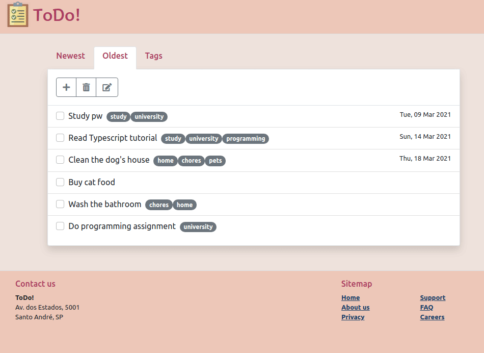
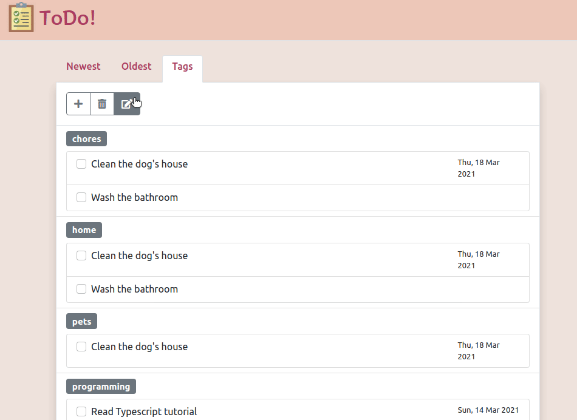
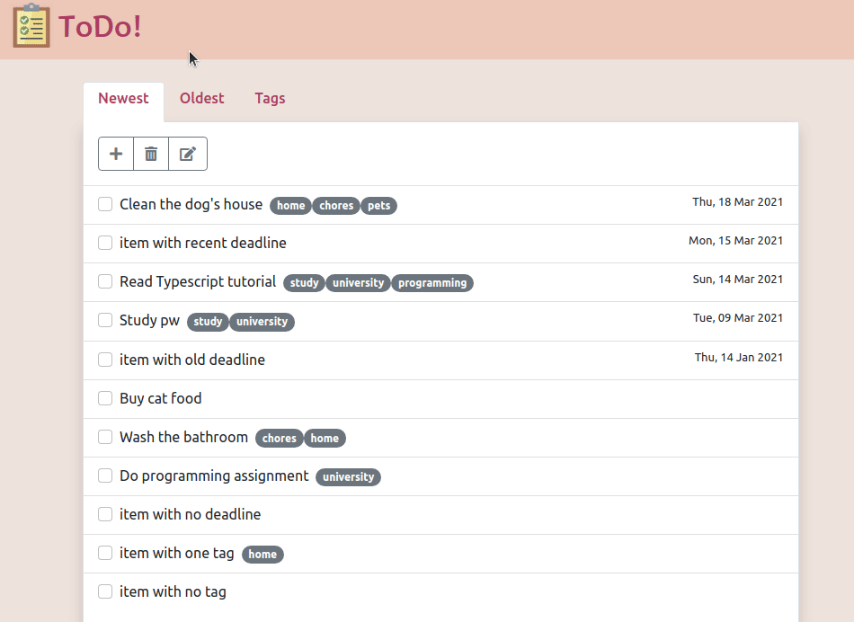

Para rodar o projeto em seu estado inicial:

* completar o arquivo `model.ts` com o seu RA
* abrir o arquivo index.html no browser

Você precisa completar o projeto conforme o enunciado no Moodle.

A seguir alguns GIFs detalhando os comportamentos esperados.

## Aba Oldest

O principal diferencial é a ordenação dos elementos, que é fundamentalmente o inverso
da aba Newest.

## Aba Tags

Os elementos devem ser agrupados por tags. Todas as operações CRUD estão disponíveis
nessa aba.

## Operação de edição

Procedimento análogo ao que fizemos para a inserção.

